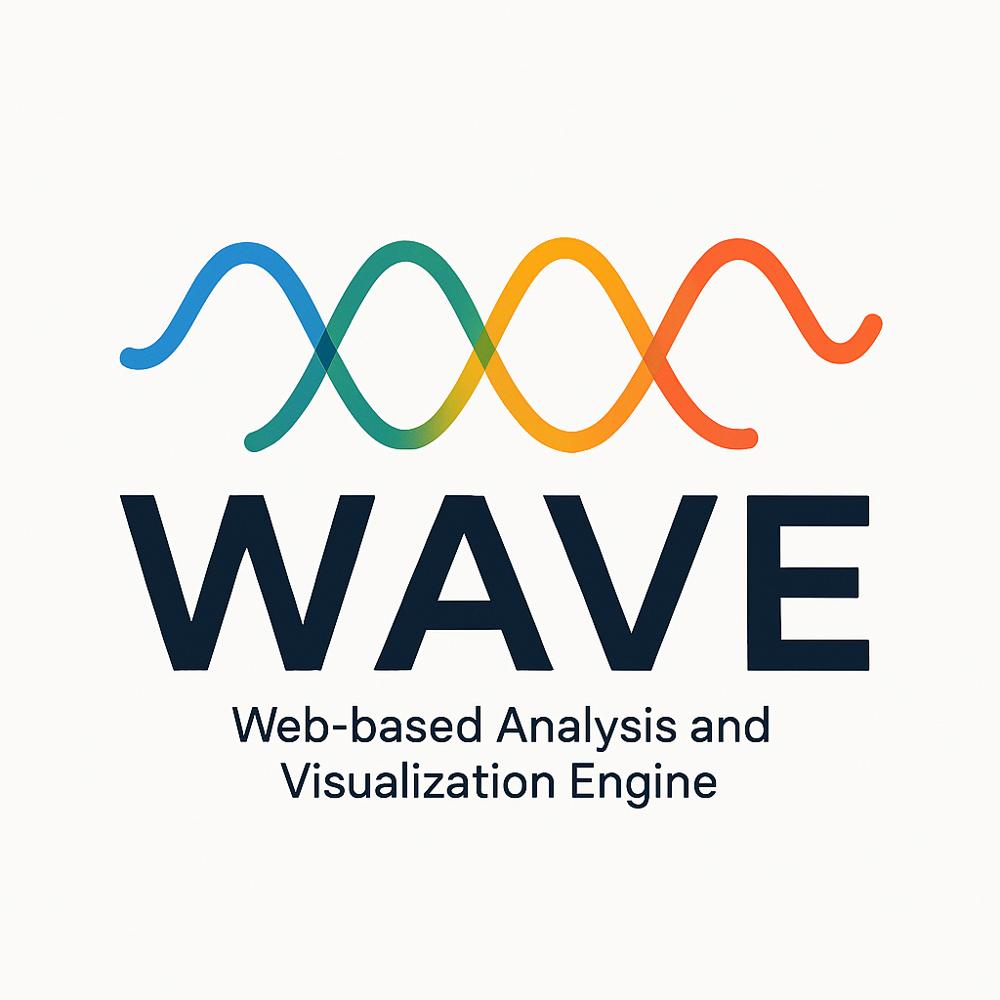

# WAVE - Web-based Analysis and Visualization Engine


## 📌 Project Overview



The **Feedback Analysis API** is a simple MVP designed to collect, store, and analyze user feedback. This project is part of the **Postgraduate Software Engineering Program at PUC-RIO** and was developed by **Vitor Fernando Castellani**.

The API provides functionalities to:

- **Feedback Management**:
  - Create, retrieve, update, and delete feedback entries.
  - Paginated listing of feedbacks.
  - Validate feedback submissions based on campaign rules (e.g., maximum submissions, IP restrictions).

- **Campaign Management**:
  - Create, retrieve, update, and delete campaigns.
  - Generate unique short codes for campaigns.
  - Paginated listing of campaigns.
  - Track feedback counts for each campaign.

- **Sentiment Analysis**:
  - Analyze the sentiment of feedback messages using Natural Language Processing (NLP) with the VaderSentiment library.
  - Analyze sentiment using a custom-trained classification model based on feedback metadata (e.g., length, word count, language).
  - Store sentiment analysis results, including sentiment score, category, detected language, word count, and feedback length.
  - Perform bulk sentiment analysis for feedbacks in specific campaigns.
  - Track the progress of feedback analysis tasks.

- **Dashboard Management**:
  - Create, retrieve, update, and delete dashboards.
  - Associate dashboards with campaigns and components.
  - Retrieve system metrics for dashboards (e.g., total campaigns, total feedbacks, active campaigns).
  - Generate data for dashboard components, including bar charts, line charts, pie charts, word clouds, sentiment analysis summaries, and trend analysis.

The API uses **SQLite** as the database for easy deployment and testing.

## 🚀 How to Run the Project

### 1️⃣ Clone the Repository
```sh
git clone https://github.com/vitorcastellani/feedback-analysis-backend.git
cd feedback-analysis-backend
```

### 2️⃣ Create a Virtual Environment
```sh
python -m venv venv
```

### 3️⃣ Activate the Virtual Environment
- **Windows:**
```sh
venv\Scripts\activate
```
- **Mac/Linux:**
```sh
source venv/bin/activate
```

### 4️⃣ Install Dependencies
```sh
pip install -r requirements.txt
```

### 5️⃣ Run the API
```sh
python app.py
```
Or using Flask directly:
```sh
flask run
```

The API will be available at: `http://127.0.0.1:5000`

## 🧪 Running the Tests
To execute all the unit and integration tests, run:
```sh
pytest -v
```
By default, a test database (`test.sqlite`) will be created in the `database/` folder, separate from the production database (`production.sqlite`).

## 📂 Database Information
The API uses **SQLite** as the database engine.
- In production mode, the database file will be: `database/production.sqlite`.
- For integration tests, the database file will be: `database/test.sqlite`.

## 🧠 ML Model Training & Smart Prediction System

A detailed description of the machine learning training scripts and the smart prediction system can now be found in [`ml_training/README.md`](ml_training/README.md).

This includes:
- ML training scripts for dataset export, model training, and sample data generation
- Smart prediction system architecture and workflow
- Automated model management and API integration details

Refer to the [`ml_training/README.md`](ml_training/README.md) for full documentation.

---

Developed by **Vitor Fernando Castellani** - PUC-RIO Software Engineering Postgraduate Program